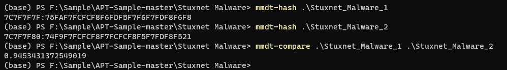

# python_mmdt

python_mmdt is a python-based mmdt library implementation. This library allows you to use mmdt through python to calculate sensitive hashes.

mmdt is a sensitive hash implementation that can be used to calculate file similarity

## Pre-Install

* `cmake`: 2.6 and above
* `windows`: The current version (0.0.1) requires `minGW` to be installed on windows

## Install from Pypi

```
$ pip install python_mmdt
```

## Install by Whl

`.whl` download from [`Release`](https://github.com/a232319779/python_mmdt/releases)

```
$ pip install python_mmdt-xxx.whl
```

## Usage

### Command Line

```sh
# calculate mmdt sensitive
$ mmdt-hash $file_path

# calculate file similarity
$ mmdt-compare $file_path1 $file_path2
```

### python code

```python
# -*- coding: utf-8 -*-

import unittest
import os
from python_mmdt.mmdt.mmdt import MMDT


class Testmmdt(unittest.TestCase):
    def test_process(self):
        mmdt = MMDT()
        test_path = os.path.dirname(__file__)
        test_samples = os.path.join(test_path, "samples")
        files = os.listdir(test_samples)
        for f in files:
            file_path = os.path.join(test_samples, f)
            r1 = mmdt.mmdt_hash(file_path)
            print(r1)
            r2 = mmdt.mmdt_hash_streaming(file_path)
            print(r2)
            sim1 = mmdt.mmdt_compare(file_path, file_path)
            print(sim1)
            sim2 = mmdt.mmdt_compare_hash(r1, r2)
            print(sim2)
```

## Screenshot

