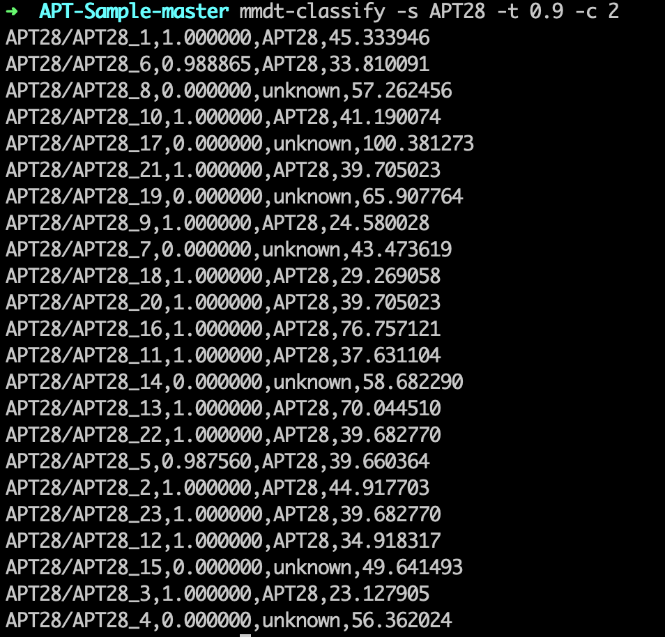

# python-mmdt

基于python的mmdt库。mmdt库是敏感哈希的一种实现。可用于文件相似度计算。

## 安装预备

* `cmake`：2.6以上版本
* `windows`：当前版本(0.2.2)需单独安装 `minGW`

## PIP安装

```
$ pip install python_mmdt
```

## 编译包安装

编译包下载地址：见[`Release`](https://github.com/a232319779/python_mmdt/releases)

## 使用

### 命令行

```sh
# 计算mmdt敏感哈希
$ mmdt-hash $file_path

# 比较相似度
$ mmdt-compare $file_path1 $file_path2

# 使用分类器实现恶意样本识别
➜ mmdt-classify -h
usage: python_mmdt malicious file scan tool [-h] [-s SCANS] [-t THRESHOLD]
                                            [-c CLASSIFY_TYPE]

A malicious scanner tool based on mmdt_hash. Version 0.2.1

optional arguments:
  -h, --help            show this help message and exit
  -s SCANS, --scans SCANS
                        set file/path to scan.
  -t THRESHOLD, --threshold THRESHOLD
                        set threshold value to determine whether the file is a
                        malicious file. (default 0.95)
  -c CLASSIFY_TYPE, --classify CLASSIFY_TYPE
                        set classify type.set 1 for simple classify, set 2 for
                        knn classify.(default 1)

Use like:
    1. use simple classify
    mmdt-classify -s $sample_path -t 0.95 -c 1
    2. use knn classify
    mmdt-classify -s $sample_path -t 0.95 -c 2
```

### python代码

```python
# -*- coding: utf-8 -*-

import unittest
import os
from python_mmdt.mmdt.mmdt import MMDT


class Testmmdt(unittest.TestCase):
    def test_process(self):
        mmdt = MMDT()
        test_path = os.path.dirname(__file__)
        test_samples = os.path.join(test_path, "samples")
        files = os.listdir(test_samples)
        for f in files:
            file_path = os.path.join(test_samples, f)
            r1 = mmdt.mmdt_hash(file_path)
            print(r1)
            r2 = mmdt.mmdt_hash_streaming(file_path)
            print(r2)
            sim1 = mmdt.mmdt_compare(file_path, file_path)
            print(sim1)
            sim2 = mmdt.mmdt_compare_hash(r1, r2)
            print(sim2)
```

## 截图示例

### 计算文件相似度


### 利用分类器实现恶意代码识别
